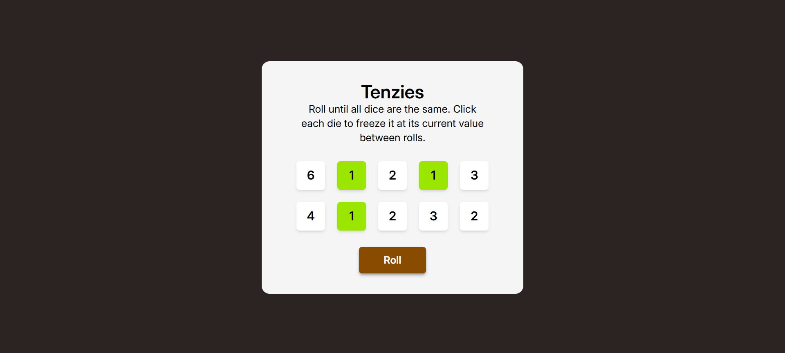

# 🎲 Tenzies Game

A fun and fast-paced interactive dice game built with React, Tailwind CSS, and `react-confetti`. Roll until all dice are the same, freezing your target numbers along the way!

## 🔗 Links

- **Live Site:** [View Live Demo](https://tenzies-game-lake-seven.vercel.app/) 
- **GitHub Repository:** [View Source Code](https://github.com/iviktorry/tenzies-game) 

---

## 🛠 Tech Stack

- **React** — Declarative UI, state management, and derived states
- **Tailwind CSS** — Utility-first styling with responsive design
- **nanoid** — Unique key generation for list rendering
- **react-confetti** — Celebratory particle effects upon winning
- **Vite** — High-performance frontend build tooling

---

## ✨ Features

- **Interactive Dice Freezing:** Click individual dice to hold or release them between rolls.
- **Smart Re-rolling:** Only unheld dice are regenerated when you click "Roll".
- **Instant Win Detection:** Automatically evaluates if all 10 dice are selected and share the exact same value.
- **Victory Celebration:** Triggers a confetti animation and changes the action button to "New Game".
- **Responsive Layout:** Optimized grid layout scaling seamlessly from mobile to desktop screens.

---

## 🧠 What I Learned & Practiced

- **State Immutability:** Updating specific items within arrays using `.map()` and object spread syntax (`...item`).
- **Derived State:** Computing victory conditions (`gameWon`) dynamically on every render instead of syncing redundant state.
- **Lazy State Initialization:** Passing callback functions into `useState` to optimize performance and prevent unnecessary initial recalculations.
- **Component Communication:** Passing identifier callbacks down to child components to maintain clean encapsulation without relying on raw DOM events.

---

## 🙋‍♀️ Author

- GitHub — [@iviktorry](https://github.com/iviktorry)
- Frontend Mentor — [@iviktorry](https://www.frontendmentor.io/profile/iviktorry)
